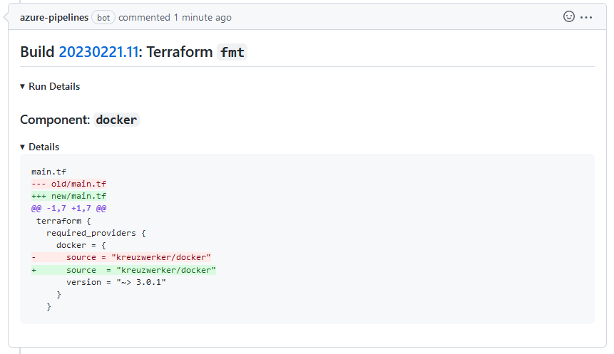

# terraform-github-pr-commenter

Bash script to render Terraform command output as GitHub Pull Request comment
ready to be posted from any CI/CD agent that can be authenticated with GitHub,
for example, Azure Pipelines or GitHub Actions.



See [screenshot/README.md](screenshot/README.md) for more visual samples of posted GitHub comments.

## Requirements

- Bash
- `iconv` or `konwert` to convert the Terraform fancy outputs to plain and easily escapable ASCII.
    The conversion especially helps to avoid Azure Pipelines [task.setvariable](https://learn.microsoft.com/en-us/azure/devops/pipelines/process/set-variables-scripts)
    tripping over fancy Unicode characters (e.g. box drawing).
- Terraform command output saved in `<00N>_<title>.<command>.{log,txt}` files (see [description](#description) below).

## Usage: CLI

```console
Usage: ./terraform-pr-comment.sh [arguments]
  -v,--verbose                Advertise detailed steps and actions (pass first for arguments logging)
  -c,--command <name>         Terraform command: fmt, plan, validate
  -p,--logs-path <path>       Location where to look for log files with Terraform command output
  -b,--build-number <number>  Build number or identifier provided by CI/CD service
  -u,--build-url <url>        Build results URL provided by CI/CD service
  -d,--disable-outer-details  Disable outer HTML <details> section
  -h,--help                   Displays this message
```

Running the script from command line is useful for testing only.
The script on its own does not post any comments to GitHub.

## Usage: CI/CD

- for Azure Pipelines example see [.azure-pipelines.yml](.azure-pipelines.yml)

## Description

The script collects Terraform command outputs from log files in given location,
combines them and renders in Markdown as content for GitHub Pull Request comment,
and returns via exported environment variable.

The script renders single comment titled with given build number and command.

The script can read multiple log files from number of runs of the same Terraform
command - one run per component of layer of user's infrastructure
Each run is rendered as separate section with its own sub-title.

The rendered content can be posted by Azure Pipeline using
[GitHubComment@0](https://learn.microsoft.com/en-us/azure/devops/pipelines/tasks/reference/github-comment-v0)
task or by GitHub Actions using GitHub Script method
[github.issues.createComment](https://github.com/actions/github-script).

Log file name format is `<00N>_<title>.<command>.{log,txt}` where

- `<00N>` part controls order in which files are read
- `<title>` part is used as heading of section for given log
- `<command>` used in the comment title together with given build number

Notice, that unlike other solutions like
[terraform-pr-commenter](https://github.com/robburger/terraform-pr-commenter),
this script does not search and delete any previous comment it posted.
This script always posts a new comment for new build result.
It is a very simple script.

## Preparing Logs

*TODO:* Explain how to prepare log files as valid input for this script.

## Credits

- [@sbulav](https://github.com/sbulav) for [Terraform processing with `jq`](https://sbulav.github.io/terraform/terraform-vs-github-actions/)
   and showing how to use [github.issues.createComment](https://github.com/actions/github-script)
- [@nbellocam](https://github.com/nbellocam) for [Azure Pipelines task `GitHubComment@0` show case](https://medium.com/southworks/continuous-integration-for-smart-contracts-4a8b78d387c)
- [@robertwbradford](https://github.com/robertwbradford) for [solving multi-line comment with `GitHubComment@0`](https://stackoverflow.com/a/72277737/151641)
- [@robburger](https://github.com/robburger) for [terraform-pr-commenter scripted in Bash](https://github.com/robburger/terraform-pr-commenter/blob/10779c60059f0f099ef676a9dde158d646555473/entrypoint.sh)
- [@ahmadnassri](https://github.com/ahmadnassri) for [inspiring Terraform reports](https://github.com/ahmadnassri/action-terraform-report)
- [@gunkow](https://github.com/gunkow) for another example of [inspiring Terraform reports](https://github.com/gunkow/terraform-pr-commenter)

Thank you all! ~Mateusz Łoskot
