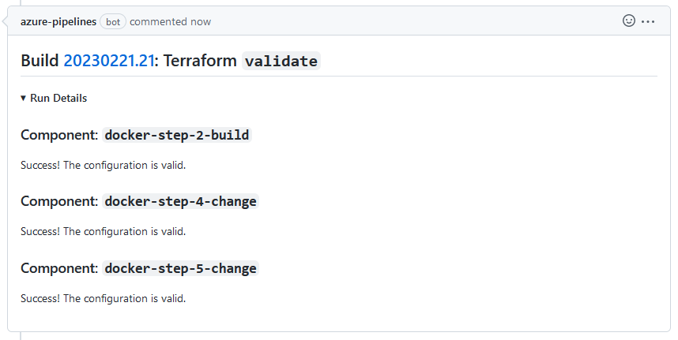
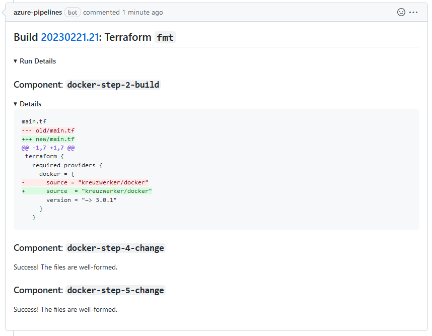
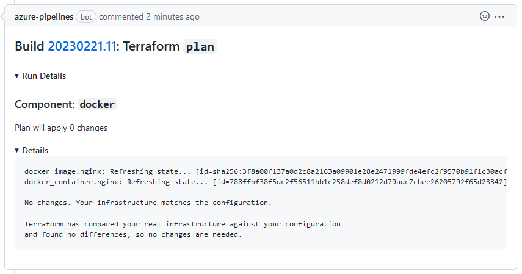
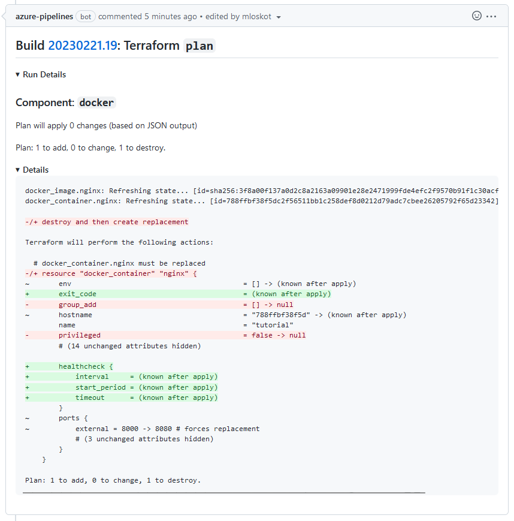

# Screenshots

## Single `validate` run for valid input

## Multiple `validate` runs for valid input

## Single `fmt` run

## Multiple `fmt` runs

## Single `plan` run yields no changes

## Single `plan` run yields changes

## Multiple `plan` runs with details collapsed

